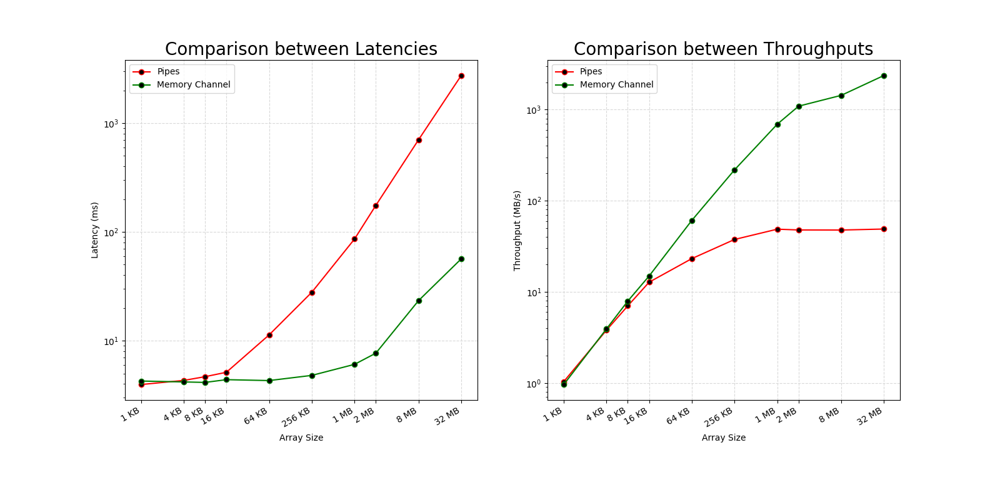

# Performance Analysis
I have conducted a `full factorial desing` 1015:
* `1 indipendent factor`: array_size
* `10 levels`: choosing 10 powers of 2, in a range from 210 (1 KB) to 225 (32 MB)
* `5 ripetitions`

resulting in a total of `50 experiments` for each sample. On the other hand, the response variables are `latency` and `throughtput`. 

As follows, there are the results:

  

