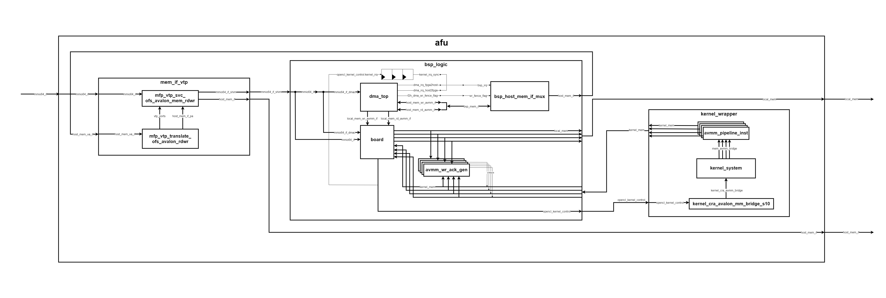
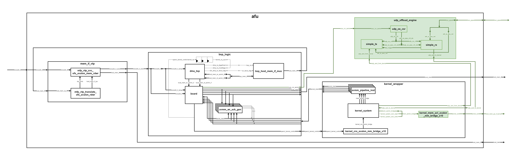

# Architectural Diagram

  

  

## Diagram Legend 
* `Box`: Module
* `Arrow`: Signal
* `Thick arrow`: Interface
* `Green box`: Module added using the INCLUDE_UDP_OFFLOAD_ENGINE and INCLUDE_USM_SUPPORT macros
* `Green arrow`: Signal added using the INCLUDE_UDP_OFFLOAD_ENGINE and INCLUDE_USM_SUPPORT macros
* `Thick green arrow`: Interface added using the INCLUDE_UDP_OFFLOAD_ENGINE and INCLUDE_USM_SUPPORT macros

## Module Descriptions 
* `mem_if_vpt`: Translates virtual addresses to physical addresses (Virtual to Physical Translation - VTP).
* `bsp_logic`: Contains BSP logic.
  * `dma_top`: Manages DMA.
  * `board`: Wraps interfaces, especially the onboard DDR memory bank.
  * `bsp_host_mem_if_mux`: Inserts special transactions on the AVMM bus (Avalon Memory-Mapped Interface) which are evaluated as interrupts by the host (Linux drivers) when the *kernel_irq* signal is high.
  * `avmm_wr_ack_gen`: Generates an acknowledgment to ensure correct AVMM bus behavior.
* `kernel_wrapper`:
  * `avmm_pipeline_inst`: Pipeline bridge between the kernel and board.qsys.
  * `kernel_system`: Hardware generated from SYCL, which includes four interfaces:
    * Output interrupt line (*kernel_irq*).
    * AVMM slave CSR interface for writing parameters and commands (e.g., start, busy, pending interrupt, etc.).
    * Read/write AVMM master interface for each DDR memory bank.
    * Read/write AVMM master interface for host memory (Shared/Unified Virtual Memory SVM/USM).

## Standards 
* `Master/Host/Source`: Outputs read, write, writedata, and address signals to specify slave operations.
* `Slave/Agent/Sink`: Outputs waitrequest, readdatavalid, readdata, and writeresponsevalid signals.
* `to_sink/to_slave`: SystemVerilog modport identifier, used to indicate the connection from source to sink (where the current module is the source).
* `to_source/to_master`: SystemVerilog modport identifier, used to indicate the connection from sink to source (where the current module is the sink).