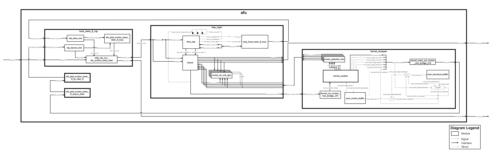
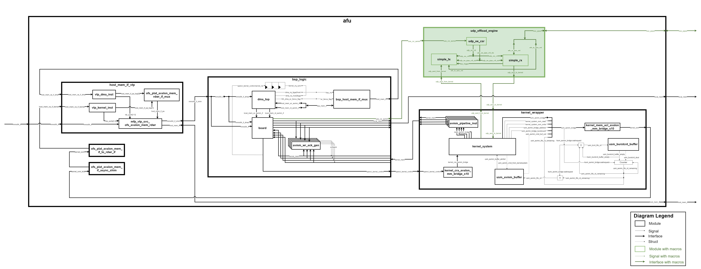

# Architectural Diagrams

As follows, the architectural diagrams of `ofs_n6001_iopipes`[[1]](references.md#ref_aspv_pipes) and `ofs_n6001_usm_iopipes`[[2]](references.md#ref_aspv_usm_pipes) ASP variants. The diagrams are divided into two categories:
* `Base Architectural Diagram`: without all macros defined. 
* `Architectural Diagram`: with all macros defined.

## ofs_n6001_iopipes ASP Variant 
* Base Architectural Diagram without `INCLUDE_UDP_OFFLOAD_ENGINE` and `INCLUDE_USM_SUPPORT macros`

  

* Architectural Diagram

  

### Modules Description 
* `mem_if_vpt`: Translates virtual addresses into physical addresses (Virtual to Physical Translation - VTP). It is located on the host memory datapath.
* `bsp_logic`
  * `dma_top`: DMA module provides a controller to execute transfers from host to DDR on the board and vice versa.
  * `board`: Wraps the interfaces, especially DDR memory bank on-baord.
  * `bsp_host_mem_if_mux`: Inserts special transactions on the AVMM bus (Avalon Memory-Mapped Interface), which are evaluated as interrupt by the host (linux drivers) when kernel_irq signal is high.
  * `avmm_wr_ack_gen`: Generates ack in order to guarantee the right behaviour AVMM bus.
* `kernel_wrapper`:
  * `avmm_pipeline_inst`: AVMM Pipeline bridge from the kernel to board. 
  * `kernel_cra_avalon_mm_bridge_s10`: AVMM Pipeline bridge from board to the kernel.
  * `kernel_mem_acl_avalon_mm_bridge_s10`: AVMM Pipeline bridge from kernel_system to host.
  * `kernel_system`: Hardware generated from SYCL, it has four interfaces:
    * output interrupt line (kernel_irq).
    * AVMM slave CSR interface used to write parameters and commands (e.g. start, busy, pending interrupt, etc).
    * read/write AVMM master interface for each DDR memory bank.
    * read/write AVMM master interface for host memory (Shared/Unified Virtual Memory SVM/USM).
* `udp_offload_engine`: Allow transmitting UDP/IP packets over HSSI.

## ofs_n6001_usm_iopipes ASP Variant 
* Base Architectural Diagram without `INCLUDE_UDP_OFFLOAD_ENGINE macro`

  

* Architectural Diagram

  

### Modules Description 
* `host_mem_if_vtp`: Translates virtual addresses into physical addresses (Virtual to Physical Translation - VTP). It is located on the host memory datapath.
* `bsp_logic`
  * `dma_top`: DMA module provides a controller to execute transfers from host to DDR on the board and vice versa.
  * `board`: Wraps the interfaces, especially DDR memory bank on-baord.
  * `bsp_host_mem_if_mux`: Inserts special transactions on the `AVMM bus (Avalon Memory-Mapped Interface)`, which are evaluated as interrupt by the host (linux drivers) when kernel_irq signal is high.
  * `avmm_wr_ack_gen`: Generates ack in order to guarantee the right behaviour of AVMM bus.
* `kernel_wrapper`:
  * `avmm_pipeline_inst`: AVMM Pipeline Bridge from the kernel to board. 
  * `kernel_cra_avalon_mm_bridge_s10`: AVMM Pipeline Bridge from board to the kernel.
  * `kernel_mem_acl_avalon_mm_bridge_s10`: AVMM Pipeline bridge from kernel_system to host_mem_if_vtp.
  * `kernel_system`: Hardware generated from SYCL, it has four interfaces:
    * output interrupt line (kernel_irq).
    * AVMM slave CSR interface used to write parameters and commands (e.g. start, busy, pending interrupt, etc).
    * read/write AVMM master interface for each DDR memory bank.
    * read/write AVMM master interface for host memory (Shared/Unified Virtual Memory SVM/USM).
  * `usm_burstcnt_buffer/usm_avmm_buffer`: Single-clock FIFO functions used for data buffering.
* `udp_offload_engine`: Allow transmitting UDP/IP packets over HSSI.
* `ofs_plat_avalon_mem_if_to_rdwr_if`: Convert kernel_svm AVMM interface into host_mem_if.
* `ofs_plat_avalon_mem_if_async_shim`: AVMM Clock Crossing Bridge for the Avalon memory interface.

## Terminology 
* `Avalon Memory-Mapped Interface`[[8]](references.md#ref_avmm): Implement read and write interfaces for Host (master) and Agent (slave) components.
* `Avalon-MM Pipeline Bridge`[[9]](references.md#ref_avmm_pipebridge): accepts commands on its slave port and propagates the commands to its master port, providing parameters to turn on pipelining for command and response signals.
* `Avalon‑MM Clock Crossing Bridge`[[10]](references.md#ref_avmm_clockbridge): transfers commands and responses between different clock domains.