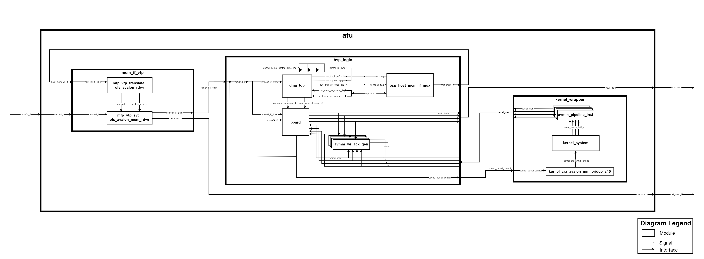

# Architectural Diagram

* ASP variant ofs_n6001_iopipes

  

* ASP variant ofs_n6001_iopipes with INCLUDE_UDP_OFFLOAD_ENGINE and INCLUDE_USM_SUPPORT macros

  

* ASP variant ofs_n6001_usm_iopipes

  

* ASP variant ofs_n6001_usm_iopipes with INCLUDE_UDP_OFFLOAD_ENGINE and INCLUDE_USM_SUPPORT macros

  

## Modules Description 
* `mem_if_vpt`: Translates virtual addresses into physical addresses (Virtual to Physical Translation - VTP).
* `bsp_logic` : Contains the BSP logic.
  * `dma_top`: DMA.
  * `board`: Wraps the interfaces, especially DDR memory bank on-baord .
  * `bsp_host_mem_if_mux`: Inserts special transactions on the AVMM bus (Avalon Memory-Mapped Interface), which are evaluated as interrupt by the host (linux drivers) when *kernel_irq* signal is high.
  * `avmm_wr_ack_gen`: Generates ack in order to guarantee the AVMM bus right behaviour.
* `kernel_wrapper`:
  * `avmm_pipeline_inst`: Pipeline bridge from the kernel to board.qsys. 
  * `kernel_system`: Hardware generated from SYCL, it has four interfaces:
    * output interrupt line (kernel_irq).
    * AVMM slave CSR interface used to write parameters and commands (e.g. start, busy, pending interrupt, etc).
    * read/write AVMM master interface for each DDR memory bank.
    * read/write AVMM master interface for host memory (Shared/Unified Virtual Memroy SVM/USM).

## Standars 
* `Master/Host/Source`: It has read, write, writedata and address signals as output, to specify slave's operations.
* `Slave/Agent/Sink`: It has waitrequest, readdatavalid, readdata, writeresponsevalid signals as output.
* `to_sink/to_slave`: SystemVerilog mopdport identifier, used to identify the connection from source toward sink (the current module is the source).
* `to_source/to_master`: SystemVerilog mopdport identifier, used to identify the connection from sink toward source (the current module is the sink).