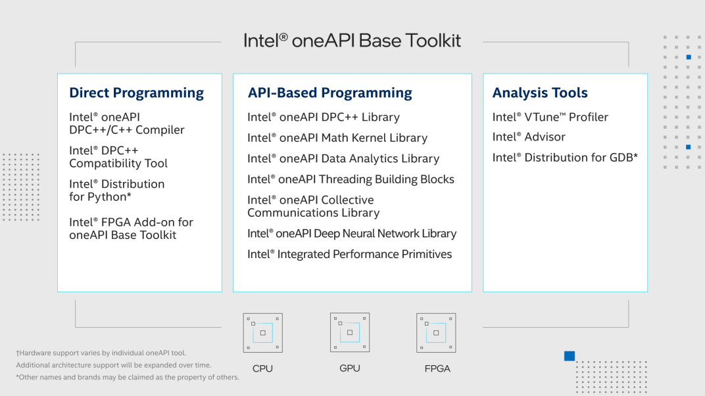
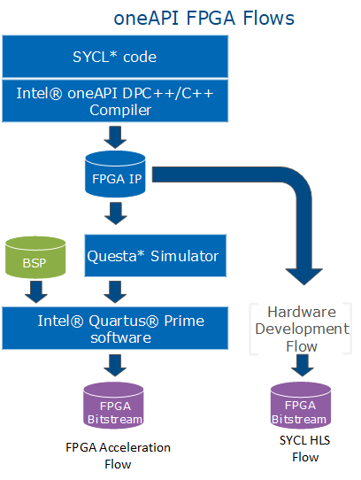

# Intel oneAPI Base Toolkit
`Intel oneAPI Base Toolkit` (known as `Base Kit`) is an implementation of the oneAPI specification and provides tools and libraries for developing high-performance, data-centric applications across architectures[[1]](references.md#ref_base_kit).

  
  <!-- 
  <em>image_caption</em> -->

## oneAPI 
`oneAPI` is a multi-architecture cross-indutry open standard `programming model`[[2]](references.md#ref_oneapi) , which guarantees portability and performance across `heterogeneous architectures` (CPUs, GPUs, FPGAs, etc...).

A oneAPI platform[[]](references.md#ref_oneapi_arch) includes:
* `Host`: Tipically a multi-core CPU, which can be seen as a device by the software. 
* `Devices`: One or more accelerators, each of them has a `command queue`. 

Each of the previous sections runs its own program:
* `Host Application`: It uses oneAPI and runs on the host.
* `Function Object` (or `kernel`): It contains a function definition and its related variables. In order to run a kernel on the device, the host application submit a command group, with the kernel, to the device's command queue. 

oneAPI is an implementation of `Khronos SYCL 2020 Specification`[[]](references.md#ref_oneapi_sycl). SYCL is a royalty-free proramming launguage based on `ISO C++` and an evolution of `OpenCL`[[]](references.md#ref_sycl). It provides an abstraction and APIs:
* To programm both CPUs and accelerator devices, using at least `C++ 17`.
* To manage data resources.
* To launch parallel code on the devices.
* To mix both `host code (executed on the host)` and `device code (executed on the device)` in the same source file[[]](references.md#ref_oneapi_sycl).

## Intel oneAPI FPGA Development Flows 
The Base Kit provides tow different development flows[[]](references.md#ref_fpga_dev)[[]](references.md#ref_fpga_dev_flow):
* `FPGA Acceleration Flow (Full-Stack flow)`: Generates the `multiarchitecture binary` (known as `fat binary`). Tha fat binary contains both host and device code (also known as `SYCL kernel`), some aspects of the device code depends on the [Board Support Package (BSP)](#glos_bsp). The full-stack flow is undertaken by setting an FPGA acceleration board as compilation target in Intel oneAPI DPC++/C++ Compiler.
* `SYCL High-Level Synthesis Flow (HLS Flow or IP Authoring Flow)`: Translates the device code into `RTL IP core` and uses the host code as the testbench for the emulation and simulation flows. The RTL IP core has to be intagrated into the design through Intel Quartus Prime Platform Designer. The FPGA capabilities do not depend on the BSP, but the programmer has to manage more section of the IP design than when generating a fat binary. The IP Authoring Flow is undertaken by setting a supported Intel FPGA device family as e compilation target in Intel oneAPI DPC++/C++ Compiler.

  

## Intel oneAPI ASP 
`oneAPI Accelerator Support Package (ASP)`[[]](references.md#ref_oneapi_asp_ref) is used to ensure communication between [hardware circuit](#glos_hardware_cir) with the oneAPI runtime and FPGA board peripherals. It is equivalent to a `BSP`.

ASP is comprised of:
* `Hardware Components`: Enable the hardware circuit to communicate with the host processor. The hardware components are divided into:
  * `RTL Components`: Represent interface logic (host to kernel interface, etc..) to handle kernel control signals and perform Direct Memory Access (DMA).
  * `XML Files`: To describe hardware interfaces and compilation environment.
  * `Scripts`: To control compile flow.
* `Software Components`: Enable the runtime to identify and communicate with the kernel. The software components are divided into:
  * `Memory Mapped Device (MMD) Layer`: Used by the host and oneAPI runtime to communicate with the oneAPI kernel and other oneAPI ASP hardware registers.
  * `oneAPI ASP Utilities`: Used to setup and diagnose the board.

Both ASP hardware components and kernels are placend in the [Accelerator Functional Unit region (AFU)](#glos_afu), Which in turn is placed inside the [Open FPGA Stack (OFS)](#glos_ofs) Hardware.

  

## I/O Pipes 
A `pipe` is an `unidirectional FIFO data structure` and allows comunication between two `endpoints`, an endpoint can be a kernel or an external I/O on the FPGA[[]](references.md#ref_pipes). There are three types of pipes:
* Kernel-Kernel
* Kernel-I/O
* I/O-Kernel

Into a pipe the data flows in a single direction, so the `bidirectional comunication` is obtained through two pipes. Through the pipe, kernels that exchange data can run concurrently. 

The communication takes place through `read and write operations`:
* A kernel can read or write from the same pipe multiple times[[]](references.md#ref_res_pipes).
* Multiple kernels cannot read or write from the same pipe[[]](references.md#ref_res_pipes).

A read/write operation can be:
* `Blocking`: It may not return immediately but are always successful.
* `Non-blocking`: It takes an extra boolean parameter that is set to true if the operation happened successfull

The `n` consecutive writes (without performing any reads) is defined by a `configurable capacity parameter`, the pipe is `full` if the `n` is equal to the parameter. If a write is performed with a full pipe, two cases can occur:
* With a blocking operation, it does not return until a read is performed by the other endpoint. Once the read is performed, the write takes place.
* With a non-blocking operation, it returns immediately (boolean parameter is set to false), the write does not have an effect.

The same goes for a read performed with an empty pipe.

## Glossary 
* `BSP`: Consists of software layers and an FPGA hardware scaffold design that makes it possible to target the FPGA through the Intel oneAPI DPC++/C++ Compiler[[]](references.md#ref_bsp).
* `Hardware Circuit`: It is generated by the oneAPI compiler from a SYCL kernel (FPGA application code), it is also known as `kernel system`[[]](references.md#ref_oneapi_asp_ref).
* `AFU`: Hardware Accelerator implemented in FPGA logic which offloads a computational operation for an application from the CPU to improve performance[[]](references.md#ref_oneapi_asp_ref).
* `OFS`: A modular collection of hardware platform components, open source software, and broad ecosystem support that provides a standard and scalable model for AFU and software developers to optimize and reuse their designs.[[]](references.md#ref_oneapi_asp_ref).