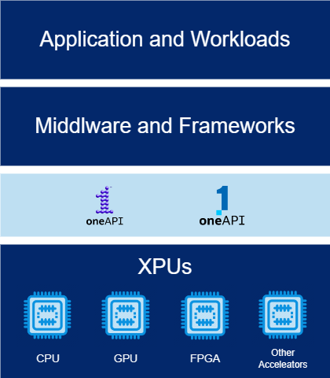

# oneAPI
`oneAPI`[[1]](references.md#ref_oneapi) is an open standard, adopted by `Intel`, which defines an `unified programmig model` for different processors and accelerator architectures by bringing all the devices on a common ground.

  

In this way code can be re-used and tools can work across the different architectures, no matter what kind of applications, workloads, middlware and frameworks are used. 

oneAPI provides: 
* Libraries related to different domains (linear algebra, machine learning, etc..). 
* Support for languages (DPC++/C++,Fortran) and their compilers.
* Analysis and Debug tools.

## oneAPI Level Zero 
oneAPI includes `Level Zero`[[2]](references.md#ref_oneapi_lzero), a low level hardware abstraction layer inside the software stack, which provides a direct-to-metal interfaces to accelerator devices.

  

This layer core APIs provide the lowest-level and fine-grain control over:
* Device Discovery and Partitioning.
* Memory Allocation, Visibility and Caching.
* `Kernels (programs runnging on the accelerators)` Execution and Scheduling.
* Peer-to-Peer Communication.
* Inter-Process Sharing.

## oneAPI Runtime  (da aggiustare)
`oneAPI runtime`, namely Accelerator Support Stack (ASP), basically is a BSP for a given board, supporting a subset of all the SYCL features.

https://www.intel.com/content/www/us/en/developer/articles/containers/intel-oneapi-runtime-libraries.html#:~:text=The%20Intel%C2%AE%20oneAPI%20Runtime%20Libraries%20is%20a%20core,code%20reuse%20across%20hardware%20targets%E2%80%94CPUs%2C%20GPUs%2C%20and%20FPGAs

## oneAPI and SYCL 
oneAPI is the implementation of `SYCL`[[]](references.md#ref_sycl), which is a cross-platform abstraction layer and an an evolution of `OpenCL`.

SYCL provides:
* An abstraction to programm (through at least C++ 17) and use in a single application `heterogeneous devices` (CPUs, GPUs, and FPGAs).
* Abstractions and APIs to find devices (e.g. CPUs, GPUs, FPGAs) on which code can be executed, and to manage data resources and code execution on those devices.

Although optimized kernel code may differ across the architectures (since SYCL does not guarantee automatic and perfect performance portability across architectures), it provides a consistent language, APIs, and ecosystem in which to write and tune code for accelerator architectures. An application can coherently define variants of code optimized for architectures of interest, and can find and dispatch code to those architectures.

SYCL uses generic programming with templates and generic lambda functions to enable higher-level application software to be cleanly coded with optimized acceleration of kernel code across an extensive range of acceleration backend APIs, such as OpenCL and CUDA.

SYCL allows an application to mix both host code and device code together in the same source file

for `Intel devices` and most of its runtime is built on top of `OpenCL hardware/software runtime`. 

## I/O Pipes  (da aggiustare)
[[]](references.md#ref_iopipe)