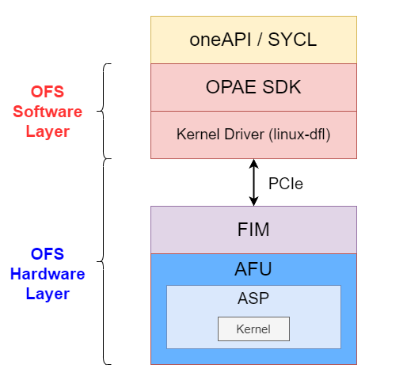

# Open FPGA Stack 
The `Open FPGA Stack (OFS)`[[1]](references.md#ref_oneapi_asp_ref) is a set of `hardware platform components` and `open source software`, ensuring a standard and scalable model for AFU and software developers to optimize and reuse their designs.

  

## oneAPI 
`oneAPI` is an open standard `programming model`[[2]](references.md#ref_oneapi)[[3]](references.md#ref_oneapi_arch) , which provides portability and performance across `heterogeneous architectures` (CPUs, GPUs, FPGAs, etc...). It is an implementation of `Khronos SYCL 2020 Specification`[[4]](references.md#ref_oneapi_sycl).

  

A oneAPI platform includes the `host` (the CPU) and `devices` (one or more accelerators); thank to the programming model, is possible to program both, by mixing both `host code` and `device code` in the same source file.

Intel provides the `Intel oneAPI Base Toolkit` (or `Base Kit`) which consists of a compiler and runtime environment[[1]](references.md#ref_oneapi_asp_ref).

## Accelerator Functional Unit 
The `Accelerator Functional Unit (AFU)` is a hardware accelerator implemented in FPGA logic which offloads a computational operation for an application from the CPU to improve performance. 

### oneAPI Accelerator Support Package 
The `oneAPI Accelerator Support Package (ASP)` is a set of hardware and software components which guarantees the comunication between `oneAPI kernel` (converted into a hardware circuit by the compiler) and the `oneAPI runtime` and `other OFS hardware/software components`. The ASP is equivalent to a `Board Support Package (BSP)`[[5]](references.md#ref_bsp), which is a set of software layers and an FPGA hardware design used to target the FPGA through the Intel oneAPI DPC++/C++ Compiler.

ASP is made up of:
* `RTL Components`: Represent interface logic (host to kernel interface, etc..) to handle kernel control signals and perform Direct Memory Access (DMA).
* `XML Files`: To describe hardware interfaces and compilation environment.
* `Scripts`: To control compile flow.
* `Utilities`: Used to setup and diagnose the board.

Both ASP hardware components and kernels are placend in the `AFU region`. 
