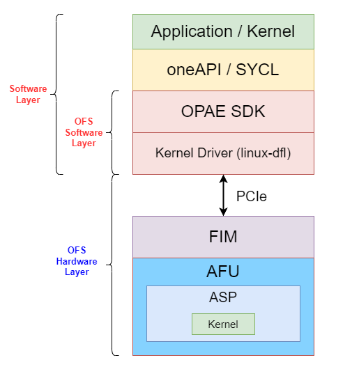

# Overall Stack 
The overall `stack` is divided into:
* `Software Layer` which containts
  * The `software application`.
  * The open standard `oneAPI`.
  * The `Open FPGA Stack Software Components`.
* `Hardware Layer` which containts the `Open FPGA Stack Hardware Components`.

  

# Open FPGA Stack 
The `Open FPGA Stack (OFS)`[[1]](references.md#ref_oneapi_asp_ref) is a set of `hardware platform components` and `open source software`, ensuring a standard and scalable model for AFU and software developers to optimize and reuse their designs.

## Accelerator Functional Unit 
The `Accelerator Functional Unit (AFU)`[[1]](references.md#ref_oneapi_asp_ref)  is a hardware accelerator implemented in FPGA logic which offloads a computational operation for an application from the CPU to improve performance. 

### Accelerator Support Package 
The `Accelerator Support Package (ASP)`[[1]](references.md#ref_oneapi_asp_ref)  is a set of hardware and software components which guarantees the comunication between `oneAPI kernel` (converted into a hardware circuit by the compiler) and the `oneAPI runtime` and `other OFS hardware/software components`. The ASP is equivalent to a `Board Support Package (BSP)`[[2]](references.md#ref_bsp), which is a set of software layers and an FPGA hardware design used to target the FPGA through the Intel oneAPI DPC++/C++ Compiler.

ASP is made up of:
* `RTL Components`: Represent interface logic (host to kernel interface, etc..) to handle kernel control signals and perform Direct Memory Access (DMA).
* `XML Files`: To describe hardware interfaces and compilation environment.
* `Scripts`: To control compile flow.
* `Utilities`: Used to setup and diagnose the board.

Both ASP hardware components and kernels are placend in the `AFU region`. 
