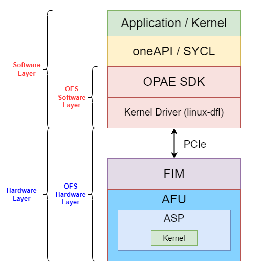

# Overall Stack 
The overall `stack` is divided into:
* `Software Layer`:
  * `Software application`.
  * `oneAPI`: A programming model that provides portability and performance across `heterogeneous architectures`.
  * `Open Programmable Acceleration Engine (OPAE) SDK`[[5]](references.md#ref_oneapi_asp_ref): Set of libraries and tools to facilitate the development of software applications and accelerators.
  * `Kernel Driver`: Linux Kernerl Driver.
* `Hardware Layer`:
  * `PCIe`.
  * `FPGA Interface Manager (FIM)`[[5]](references.md#ref_oneapi_asp_ref): Provides standard interfaces to host and AFU.
  * `Accelerator Functional Unit (AFU)`.

  

# Open FPGA Stack 
The `Open FPGA Stack (OFS)`[[6]](references.md#ref_ofs) is a set of  `open-source hardware and software components` used to create a custom FPGA platform.

## Accelerator Functional Unit 
The `Accelerator Functional Unit (AFU)`[[5]](references.md#ref_oneapi_asp_ref) is a hardware accelerator implemented in FPGA logic which offloads a computational operation for an application from the CPU to improve performance. 

### oneAPI Accelerator Support Package 
The `oneAPI Accelerator Support Package (ASP)`[[5]](references.md#ref_oneapi_asp_ref)  is a set of hardware and software components which guarantees the comunication between `oneAPI kernel` (converted into a hardware circuit by the compiler) and the `oneAPI runtime` and `other OFS hardware/software components`. 

The ASP is equivalent to a `Board Support Package (BSP)`[[7]](references.md#ref_bsp), which is a set of software layers and an FPGA hardware design used to target the FPGA through the Intel oneAPI DPC++/C++ Compiler.

ASP is made up of:
* `RTL Components`: Represent interface logic (host to kernel interface, etc..) to handle kernel control signals and perform Direct Memory Access (DMA).
* `XML Files`: To describe hardware interfaces and compilation environment.
* `Scripts`: To control compile flow.
* `Utilities`: Used to setup and diagnose the board.