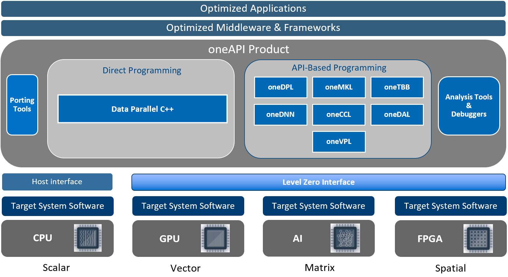

# oneAPI
`oneAPI`[[1]](references.md#ref_oneapi) is an open standard, adopted by `Intel`, which defines an `unified programmig model` for different processors and accelerator architectures by bringing all the devices on a common ground.

  

In this way code can be re-used and tools can work across the different architectures, no matter what kind of applications, workloads, middlware and frameworks are used. 

oneAPI provides: 
* Libraries related to different domains (linear algebra, machine learning, etc..). 
* Support for languages (DPC++/C++,Fortran) and their compilers.
* Analysis and Debug tools.

## oneAPI Level Zero 
oneAPI includes `Level Zero`[[2]](references.md#ref_oneapi_lzero), a low level hardware abstraction layer inside the software stack, which provides a direct-to-metal interfaces to accelerator devices.

  

This layer core APIs provide the lowest-level and fine-grain control over:
* Device Discovery and Partitioning.
* Memory Allocation, Visibility and Caching.
* `Kernels (programs runnging on the accelerators)` Execution and Scheduling.
* Peer-to-Peer Communication.
* Inter-Process Sharing.

## oneAPI Runtime  (da aggiustare)
`oneAPI runtime`, namely Accelerator Support Stack (ASP), basically is a BSP for a given board, supporting a subset of all the SYCL features.

## oneAPI and SYCL 
oneAPI is the implementation of `SYCL`[[]](references.md#ref_sycl), which is a cross-platform abstraction layer and an evolution of `OpenCL`.

SYCL provides an abstraction and APIs :
* To programm `heterogeneous processors` (CPUs, GPUs, FPGAs, etc...) using `standard ISO C++` (at least C++ 17).
* To find processors on which code can be executed.
* To manage data resources and code execution on those processors.
* To use those processors in a single application; so, in the same source file, are mixed both CPUs code (known as `host code`) and a accelerators code (known as `device code`).

  

## I/O Pipes  (da aggiustare)
[[]](references.md#ref_iopipe)
