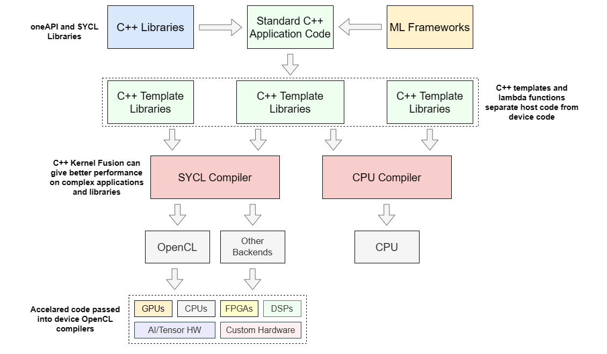

# oneAPI

## Introduction 
`oneAPI` is a multi-architecture cross-indutry open standard `programming model`[[1]](references.md#ref_oneapi) , which is based on `data parallelism` (the same computation is performed on each data element)[[2]](references.md#ref_oneapi_intro). This programming model guarantees portability and performance across `heterogeneous processors and accelerators` (CPUs, GPUs, FPGAs, etc...), bringing all of them on a common ground.

  

oneAPI provides[[3]](references.md#ref_oneapi_sarch): 
* Direct Programming (Data Parallel C++), where the application programmer writes the parallel algorithm.
* Libraries related to different domains (linear algebra, machine learning, video processing, etc..). 
* Analysis and Debug tools.

## oneAPI Platform 
A `oneAPI platform`[[3]](references.md#ref_oneapi_sarch) contains on the hardware side:
* `Host`: Tipically a multi-core CPU, which can be seen as a device by the software. 
* `Devices`: One or more accelerators, each of them has an `command queue`. 

On the software side:
* `Host Application`: It uses oneAPI and runs on the host.
* `Function Object (or Kernel)`: It contains a function definition and its related variables. In order to run a kernel on the device, the host application submit a `command group`, with the kernel, to the device's command queue. 

The host application and kernels communicate through differnt types of `shared memory` and synchronize through events.

## Level Zero 
`oneAPI Level Zero`[[4]](references.md#ref_oneapi_lzero)[[5]](references.md#ref_oneapi_lzero_spec) provides a `low-level direct-to-metal interfaces` related to the oneAPI platform devices and supports differnt language features (function pointers, I/O capabilities, etc...).

  

Level Zero `core API` provides the lowest-level and fine-grain control over[[5]](references.md#ref_oneapi_lzero_spec):
* Device discovery and partitioning
* Memory allocation, visibility and caching
* Kernels execution and scheduling
* Synchronization primitives
* Etc...

`Level Zero API architecture` displays:
* Physical Abstractions for device, sub-device, and memory.
* Logical Abstractions for command queues, events, and synchronization methods (related to to device-level physical capabilities).

## SYCL 
oneAPI is an implementation of `Khronos SYCL 2020 Specification` and `SYCL extensions` (to add more functionality)[[6]](references.md#ref_oneapi_sycl). SYCL is a proramming launguage based on `ISO C++` and an evolution of `OpenCL`. 

SYCL provides an abstraction and APIs[[6]](references.md#ref_oneapi_sycl)[[7]](references.md#ref_sycl) :
* To programm both CPUs and accelerator devices (using at least C++ 17).
* To manage data resources.
* To launch parallel code on the devices.
* To mix both `host code` and `device code` in the same source file.

  

