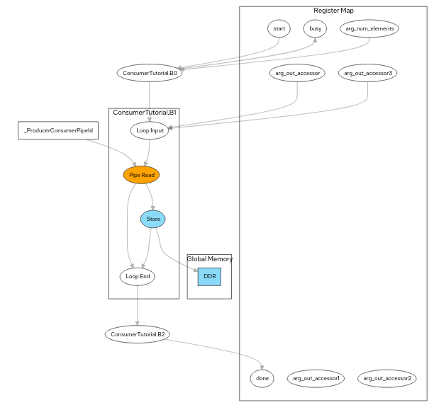
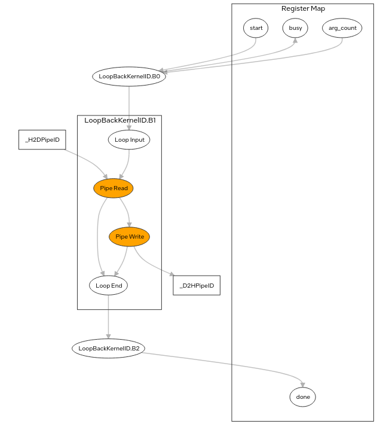

# Report

|Sample Name|Number of Pipes|Pipe Type                                              |Pipe Capacity|Global Memory
|:---:      | :---:         |:---:                                                  |:---:        |:---:
|Pipes      |Single Pipe    |Kernel to Kernel                                       |4            | Yes
|Host Pipes |Two Pipes      |<ul><li>Host to device</li><li>Device to Host</li></ul>|8            | No
            
## System Viewer
* Pipes Sample

  
  

* Host Pipe Sample

  

## Loop Analysis
|Sample Name|Kernel                                                   |Pipelined|Block Estimated fMAX (MHz)|Latency (ms)                     |Speculated Iterations|Max Interleaving Iterations
|:---:      | :---:                                                   |:---:    |:---:                     |:---:                            |:---:                |:---:
|Pipes      |<ul><li>Producer Kernel</li><li>Consumer Kernel</li></ul>|Yes      |480                       |<ul><li>846</li><li>157</li></ul>|1                    |1
|Host Pipes |SubmitLoopBackKernel                                     |Yes      |480                       |188                              |1                    |1

* Producer Kernel presenta una maggiore latenza perché effettua una lettura della memoria globale (?)
* Speculated Iterations e Max Interleaving Iterations possono essere modificati

## Area Estimates
|Sample Name|Type                                                                                                               |ALUTs                                         |FFs                                           |MLABs                    
|:---:      | :---:                                                                                                             |:---:                                         |:---:                                         |:---:                           
|Pipes      |<ul><li>Pipes Resuorces</li><li>Producer Kernel</li><li>Consumer Kernel</li></ul>                                  |<ul><li>27</li><li>1092</li><li>1110</li></ul>|<ul><li>206</li><li>2722</li><li>2494</li></ul>|<ul><li>0</li><li>2</li><li>0</li></ul>
|Host Pipes |<ul><li>Host to Device Pipe Resuorces</li><li>Device to Host Pipe Resuorces</li><li>SubmitLoopBackKernell</li></ul>|<ul><li>11</li><li>11</li><li>4909</li></ul>  |<ul><li>102</li><li>102</li><li>4106</li></ul>                      |<ul><li>2</li><li>2</li><li>34</li></ul>                             

* La pipe di Pipes Sample necessita di più risorse perché mette in collegamento due kernel (?)
* SubmitLoopBackKernell necessita di più risorse perché deve leggere da una pipe, eseguire "SomethingComplicated" e scrive il risultato su un'altra (?)