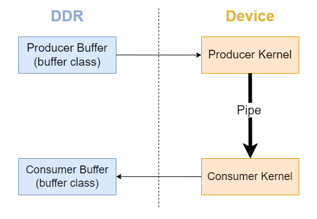
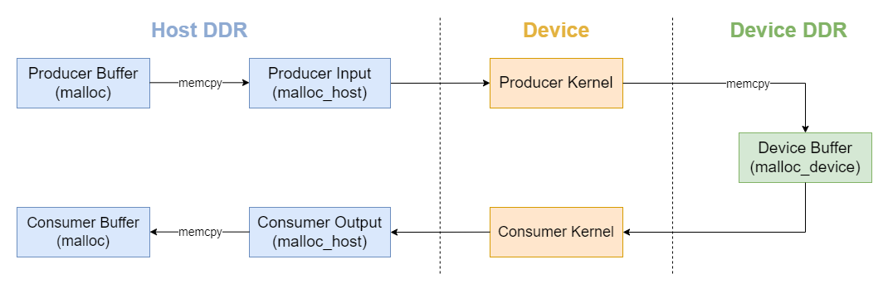

# oneAPI Samples
In order to compare the two data movement mechanisms, were usaed to two different samples:
* `Pipes Sample` wich implemets the `pipes abstraction`.
* `Memory Channel Sample` wich implemets the `unified shared memory abstraction`.

## Pipes 
A `pipe`[[6]](references.md#ref_pipes_sample) is an `unidirectional FIFO data structure` and allows comunication between two `endpoints`, an endpoint can be a kernel or an external I/O on the FPGA. There are three types of pipes:
* Kernel-Kernel
* Kernel-I/O
* I/O-Kernel

The communication takes place through `read and write operations`. The `n` consecutive writes (without performing any reads) is defined by a `configurable capacity parameter`, the pipe is `full` when the number of consecutive writes executed is equal to n. 

Into a pipe the data flows in a single direction, so the `bidirectional comunication` is obtained through two pipes. Through the pipe, kernels that exchange data can run concurrently. 

### Pipes Sample 
The `Pipes Sample` has two kernels:
* `Producer Kernel`: Reads data from a `SYCL input buffer` and writes it to a pipe.
* `Consumer Kernel`: Reads data from the pipe, performs some work on it, and writes the results to a `SYCL output buffer`.

<figure align="center">
  
  <figcaption>Pipes Sample Diagram</figcaption>
</figure>

## Unified Shared Memory 
The `Unified Shared Memory (USM)`[[7]](references.md#ref_explicit_sample) provides a C/C++ pointer-based memory management interfaces in SYCL. 

USM provides three types of allocations:
* `Device allocation`: Allocates device memory through `malloc_device`, accessible from the device.
* `Host allocation`: Allocates host memory through `malloc_host`, accessible from both host and device.
* `Shared allocation`: Allocates shared memory through `malloc_shared`. The memory can live on the host or on the FPGA and may be moved at runtime between them depending on the memory access pattern.

With USM allocation, the programmer explicitly:
* Copies data to or from the FPGA DDR using `SYCL memcpy function`.
* Manages the `synchronization between kernels` accessing the same device pointers using `wait function of a SYCL event` or the `depends_on signal` between events.

### Memory Channel Sample 
The `Memory Channel Sample` has:
* `Producer Function`: Copies data from host memory to device memory.
* `Consumer Kernel`: Reads data from device memory, performs some work on it and copies the results back to host memory.

<figure align="center">
  
  <figcaption>Memory Channel Sample Diagram</figcaption>
</figure>