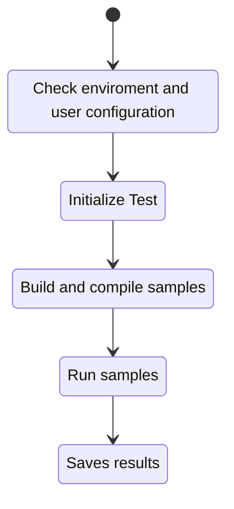

# Implementation in Detail

## Project Structure <a name="ch_pr_struct"></a>
* `pipes folder`: cpp source files with the [pipe abstraction](../doc/intel_oneAPI.md#ch_pipes)
* `memory_channel folder`: cpp source files with [USM allocations](../doc/intel_oneAPI.md#ch_usm)
* `python script folder`: python and bash source files needed for test automatization
    * `oneapi_test.py`: python main source file
    * `oneapi_test_utils.py`: python source file with the functions implementations
    * `oneapi_test_config.py`: python main source file which holds the configuration variables
    * `sample_build.sh`: bash script to build and compile the sample
    * `sample_run.sh`: bash script to run the sample

## Control Flow <a name="ch_flow_control"></a>



## How to Run <a name="ch_run"></a>
* Set indipendent factors in `test_list.csv` file.
* Set environment variables
```bash
  source full/path/to/setvars.sh 
```
* run build script
```bash
  ./sample_build.sh full/path/to/sample full/path/to/asp/asp_version board_variant
```
* Starts the `oneapi_test.py` script.
```bash
  python3 oneapi_test.py
```
* Reads response variables from `test_result.csv` file.

<p align="center">
  
</p>
