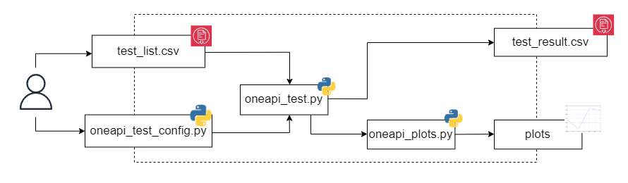

# Implementation in Detail
Given `indipendent factors`, the python script performs test cases in order to measures `response variables` of two samples:
* `pipes`: which implements [pipe abstraction](../doc/intel_oneAPI.md#ch_pipes).
* `memory_channel`: which implements [USM device allocations](../doc/intel_oneAPI.md#ch_usm).

Each sample implemente thw comunication between `SYCL Producer and Consumer kernels`. Each kernel uses:
* `loop unrolling mechanism`<sup>[[14]](../doc/references.md#ref_lunroll_sample)</sup> to increase program parallelism by duplicating the compute logic within a loop and to improve throughput.
* `kernel_args_restrict attribute`<sup>[[15]](../doc/references.md#ref_karg_sample)</sup> to improve kernel performance by enabling more aggressive compiler optimizations.


The ASP targetted is:
* `n6001 platform`
* `ofs_n6001_usm_iopipes variant`<sup>[[16]](doc/references.md#ref_asp)</sup> which supports both shared virtual memory between host and device and pipes interfaces for the kernel system.

## Python Script Control Flow <a name="ch_flow_control"></a>


## How to Run <a name="ch_run"></a>
* Set sample name and indipendent factors in `test_list.csv`.
* Set configuration variables in `oneapi_test_config.py`. 
* Set environment variables
```bash
  source full/path/to/setvars.sh 
```
* Run `oneapi_sample_build.sh` to build the program
```bash
  ./oneapi_sample_build.sh full/path/to/sample full/path/to/asp/version asp_version asp_variant
```
* Run `oneapi_test.py` to start test cases
```bash
  python3 oneapi_test.py
```
* Reads response variables from `samplename_test_result.csv` file.

<p align="center">
  
</p>